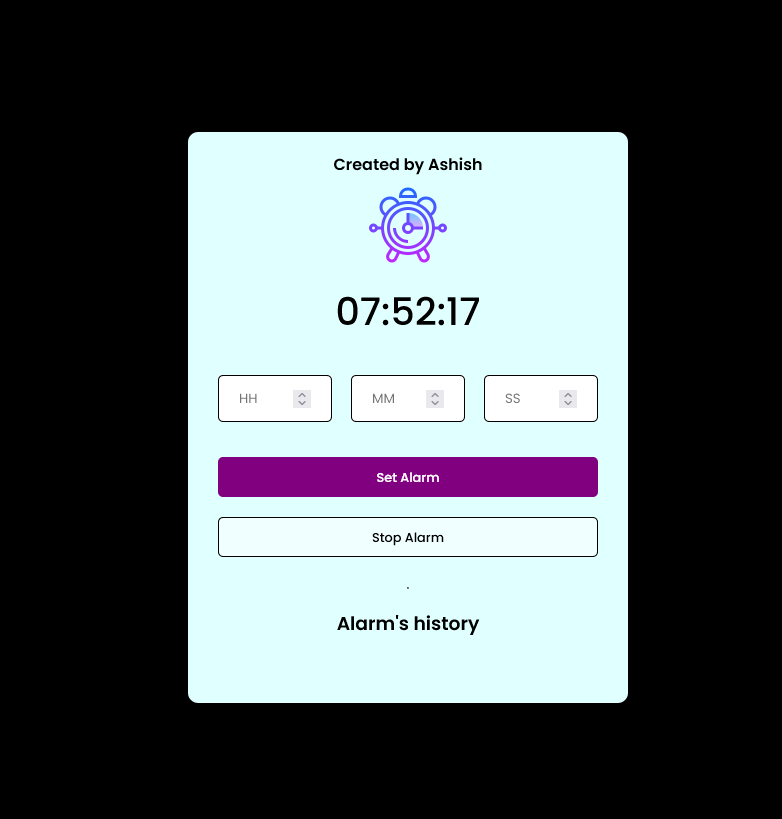

# Digital-Alarm-Clock

# Using
HTML5, CSS3, JavaScript

This is a digital alarm web application where a user can set multiple alarms. The first element of this alarm clock is a display where the real time is being shown. After the current time display, there is a form that takes the input time and when the set alarm button is pressed the input time is added to the upcoming alarms list. When the current time matches any element of the upcoming alarm list, It shows an alert and plays an audio to alert the users. there is a stop alarm button to stop the audio. The elements in upcoming alarm list comes with a delete button which is used to delete that particular alarm form the alarm list.
